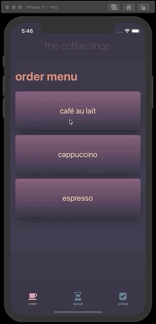

# The Coffee Shop (Vanilla React Native App)

Partial demonstration of coffee shop functionality:

- select a menu item to place an order
- process queue of orders
- pick up orders as they become available

Integrated tools include:

- React Native 63
- React Navigation 5
- React Native Progress
- React Native Root Toast
- React Native Vector Icons 7
- React Native Linear Gradient
- React Hooks

---

## iOS Preview



---

## Getting Started

### Clone repo locally.

```
git clone git@github.com:simongt/coffee-shop.git
```

### Install necessary dependencies for project.

```
yarn install
```

### Launch app locally on simulator.

```
yarn run ios
```

---

## Notes

App has only been tested on iOS thus far. Android testing TBD.

### Vector Icons

Customizable Icons for React Native:

> https://oblador.github.io/react-native-vector-icons/
